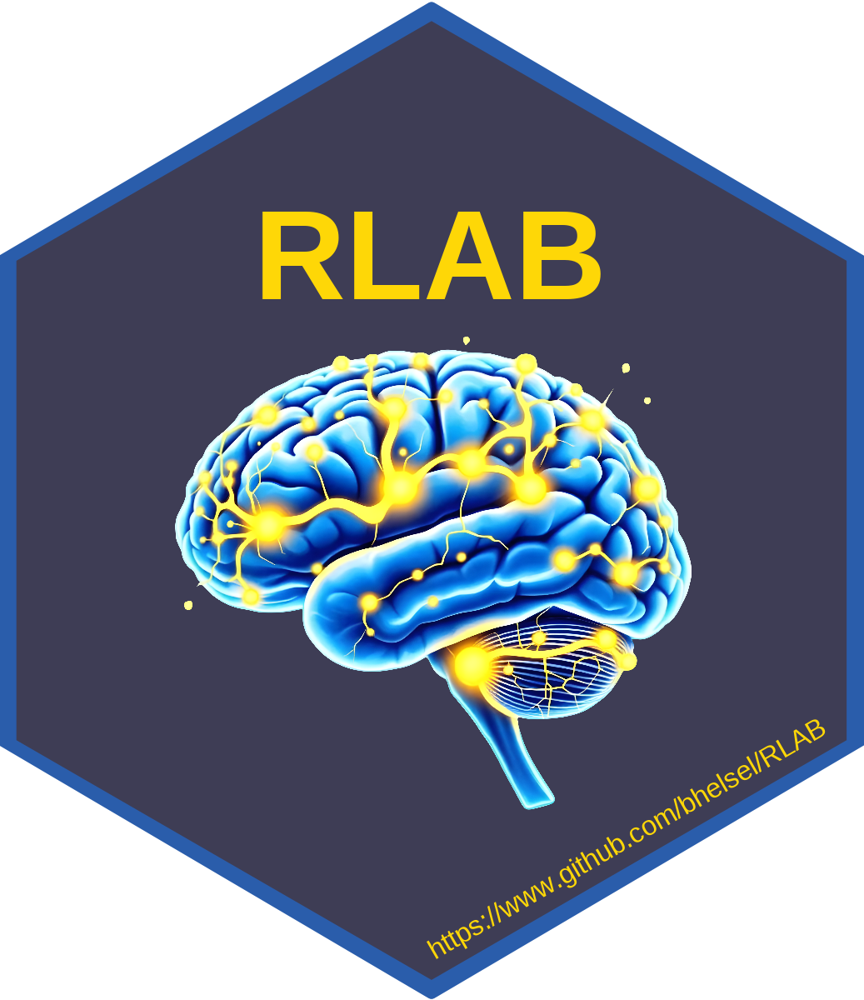

# RLAB 

<!-- badges: start -->
<!-- badges: end -->

The goal of RLAB is to ...

## Installation

You can install the development version of RLAB from [GitHub](https://github.com/bhelsel/RLAB) with:

```r
# install.packages("devtools")
devtools::install_github("bhelsel/RLAB")
```

## Render a Presentation

To render a presentation, there is a utility function called `render_presentation`

```r
library(RLAB)
# Set your output directory to the location you want the presentation stored
# The function will create the folder if it does not exisit
outpath <- "full/path/to/your/output/directory"
render_presentation(outdir = outpath, name = "02")

```

The `name` argument uses matching via regular expressions, so it can be **02**
or the full name **02-AdvR-Names-Values**.

The list of completed presentations include:

- 01-R-Basics
- 02-AdvR-Names-Values
- 03-AdvR-Vectors

## Hex Sticker

This is code used to generate and download the Hex sticker after the package is
installed. Change the file name if you want to save it in a different location

```r

hexSticker::sticker(
  system.file("images/brain.png", package = "RLAB"),
  s_x = 1,
  s_y = 0.9,
  s_width = 0.65,
  s_height = 0.65,
  package = "RLAB",
  p_size = 40,
  p_y = 1.5,
  filename = "man/figures/RLAB.png",
  h_color = "#2a5dab",
  h_fill = "#3E3D55",
  p_color = "#fed707",
  p_family = "sans",
  p_fontface = "bold",
  url = "https://www.github.com/bhelsel/RLAB",
  u_color = "#fed707",
  u_family = "sans",
  u_size = 8.75,
  dpi = 600
)

```
